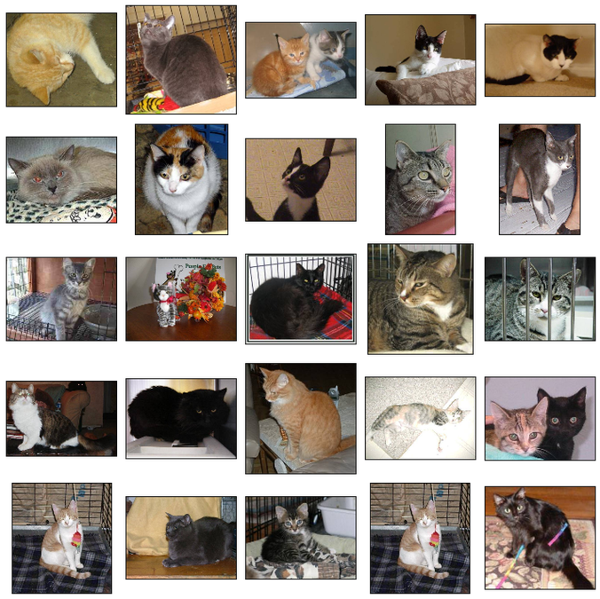

# Dog Cat Classification - Pet Project

Xây dựng mô hình VGG16 từ zero để thực hiện bài toán phân loại Dog và Cat cơ bản


# Dữ liệu 

Dữ liệu được lấy từ Kaggle:

```
https://www.kaggle.com/c/dogs-vs-cats
```

Dữ liệu train bao gồm 25,000 bức ảnh của Dog và Cat. Nhãn được quy ước: 1 = dog, 0 = cat



# Kiến trúc của mô hình

Repo sử dụng kiến trúc của VGG16 và được xây dựng từ zero nhằm mục đích hiểu rõ bản chất của các mô hình dự đoán trong Computer Vision

